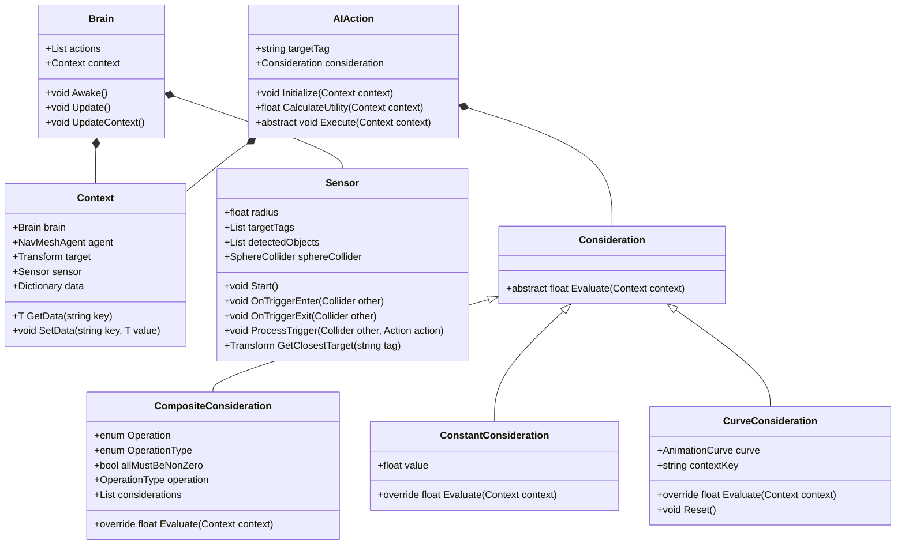
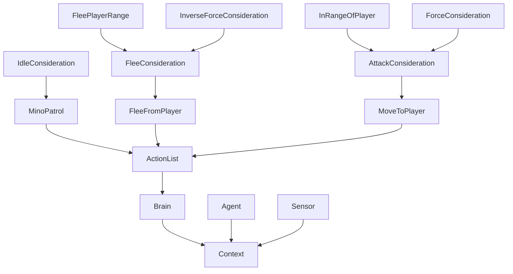

# Proyecto final de IAV - Implementación Utility AI
> **Marcos Pérez Martínez**

## Instalación y uso

> Todo el contenido del proyecto está disponible aquí en este proyecto. **Unity 6000.0.34f1** es empleado para este proyecto. También es necesario inicializar Git LFS al bajarse el repositorio. 

## Introducción
> Este es el proyectio final de la asignatura de Inteligencia Artificial para Videojuegos del Grado en Desarrollo de Videojuegos de la UCM.
>
> La idea de este proyecto es desarrollar una *Utility AI* funcional desde cero e implementar un comportamiento algo complejo a varios enemigos.

## Punto de partida
> Se parte de un proyecto base proporcionado por el profesor y disponible en este repositorio : [Minotaur - Base](https://github.com/narratech/minotaur-base).
> 
> Sin embargo, hay muchas funcionalidades de la base que se deshechan. Se mantiene únicamente la generación del laberinto. La implementación de grafo para recorrer el laberinto se quita y se sustituye por una *NavMesh* para mayor facilidad de cálculos de rutas en el proyecto. Esto se debe a que la practica en sí está enfocada en la correcta implementación de la *Utility AI* y no en la navegación. También se desecha los scripts de Agente y ComportamientoAgente. Además de la modificación de scripts ya exixtentes. 

## Planteamiento de problemas 
> ### A
> Cambio de la practica 2 a nueva implementación. Mientras se mantiene la generación de mapa mediante el GameManger, quitar TheseusGraph y hacerlo mediante NavMesh. Para la generación de minotauros, hacer que se generen aleatoriamente en una posición válida dentro del mapa. Pueden instanciarse solos o en grupo, siendo aleatorios la cantidad de minotauros y la fuerza de los mismos. Siempre estando en un rango mínimo y máximo. Además de agregar que, tanto los minotauros y el jugador tenga puntos de fuerza. También, que haya unas pelotas que las pueda recoger el jugador y que le sume puntos de fuerza al agarrarlas.
> 
> ### B
> Implementar la lógica de grupos. Cuando dos o más minotauros están juntos dentro de un rango, y sin tener obstáculos en medio, se considera que pertenecen al mismo grupo. Y cuando se separen cierta distancia, dejan de pertenecer al mimso grupo. Pudiendo asi anexionarse varios grupo o bien separarse en grupos más pequeños.
> 
> ### C
> Implementar las clases básicas de una *Utility AI* para que sea utilizable para cualquier persona que se descargue el proyecto. (Se explicará más a fondo en la resolución de problemas)
>
> ### D
> Como comportamiento *Idle* cada minotauro/grupo patruyará alrededor de un punto fijo calculado previamente y yendo de forma aleatoria a posiciones dentro de un radio en base con ese punto como centro.
> 
> ### E
> Comportamiento de comparación de fuerza entre minotauros y el jugador. Asegurarse de que se tiene en cuenta la fuerza media del grupo de minotauros (en caso de estar en grupo) y a esa media se le sumará un bonus (cuantos más minotauros en el grupo, más alta será la fuerza general del grupo). En caso de tener menos fuerza que el jugador le perseguirá siempre y cuando no haya paredes u obstáculos en medio. En caso contrario, si tienen menos fuerza que el jugador huirán. Sin embargo, a la hora de huir habrá dos comportamientos:
>     - Ir hacia el minotuaro más cercano (que no pertenezca a su mismo grupo).
>     - En caso de no ser posible, se dirige a una posición aleatoria dentro del mapa.

## Adaptación y lógica de grupos (A y B)
> Primero de todo, se ha desechado toda la lógica implementada en la practica 2. Únicamente mantenemos la lectura del mapa mediante un grafo. Luego *buildeamos* la NavMesh, para poder hacer los calculos para la generación de los minotauros. En el script MinoManager calculamos posiciones aleatorias en la NavMesh y generamos dentro de un rango los minotauros. Dichas posiciones deben de ser válidas, es decir, que estén dentro de la NavMesh y que no tengan la altura suficiente como para que estén sobre los muros.
>
```
FUNCTION GenerateMinoGroups()
    FOR i FROM 1 TO numGroups DO
        basePos ← TryGetRandomNavMeshPosition()
        IF basePos IS INVALID THEN CONTINUE

        groupSize ← Random(minGroupSize, maxGroupSize)
        groupMembers ← []

        attempts ← 0
        maxAttempts ← groupSize * 10

        WHILE groupMembers.Count < groupSize AND attempts < maxAttempts DO
            attempts ← attempts + 1
            offset ← RandomDirection2D() * spawnRadius
            candidatePos ← basePos + offset

            IF NavMesh.Sample(candidatePos) IS VALID AND CloseTo(basePos) THEN
                mino ← Instantiate Minotaur at candidatePos
                Add mino TO listMinotaurs
                Add mino TO groupMembers

                Assign random force to mino
            ENDIF
        ENDWHILE

        IF groupMembers.Count ≥ 2 THEN
            first ← groupMembers[0]
            second ← groupMembers[1]
            Create new group with first and second

            FOR EACH mino IN groupMembers[2 to end] DO
                Add mino to the same group
            ENDFOR
        ENDIF
    ENDFOR
END FUNCTION
```
```
FUNCTION TryGetRandomNavMeshPosition()
    center ← mapSize() / 2
    FOR attempts FROM 1 TO 20 DO
        randomPoint ← center + RandomPointInSphere(radius)
        randomPoint.y ← 0

        IF NavMesh.Sample(randomPoint) IS VALID AND Height IS VALID THEN
            RETURN randomPoint
        ENDIF
    ENDFOR
    RETURN INVALID
END FUNCTION
```

> En cuanto a la fuerza es un script simple donde se almacena el valor de fuerza y una variable estática para la fuerza máxima para poder normalizarla a la hora de hacer las comparaciones.
> 
> Para la gestión de grupos, lo hacemos mediante un Dictionary de C# en el que guardamos la ID de cada grupo y una lista de los minotauros de cada grupo. Para no dejar grupos vacios, tenemos una Queue en donde almacenamos las IDs de los grupos que se van quedando vacíos para no desperdiciar memoria.
> 
> Cada minotauro tiene un **GroupComponent** que se encarga de almacenar la ID del grupo al que pertenece (en caso de estar solo se marca como **-1**). Además, comprueba si existen minotauros alrededor para comporbar si hay que unirse o separse de un grupo.
```
FUNCTION Update()
    hits ← Physics.OverlapSphere(position, groupRadius, minotaurMask)
    foundNearby ← FALSE

    FOR EACH hit IN hits DO
        other ← hit.gameObject
        IF other IS self THEN CONTINUE
        IF other.tag ≠ groupTag THEN CONTINUE

        otherComp ← other.GetComponentInParent(GroupComponent)
        IF otherComp IS NULL THEN CONTINUE

        distance ← Distance(self.position, other.position)
        direction ← Normalize(other.position - self.position)

        IF NOT Physics.Raycast(self.position, direction, distance + ε, obstacleMask) THEN
            IF self.g_id = -1 OR otherComp.g_id = -1 OR self.g_id ≠ otherComp.g_id THEN
                MinoManager.AssignSameGroup(self, other)
            ENDIF

            foundNearby ← TRUE
        ENDIF
    ENDFOR

    IF self.g_id ≠ -1 AND foundNearby = FALSE THEN
        MinoManager.RemoveFromGroup(self, g_id)
    ENDIF
END FUNCTION
```
> En cuanto a lógica de adición y eliminación de grupos, el MinoManager se encarga de esto. Estos son las funciones que se emplean y que son llamados desde el GroupComponent:
```
FUNCTION AssignSameGroup(mino1, mino2)
    comp1 ← Get GroupComponent of mino1
    comp2 ← Get GroupComponent of mino2

    IF comp1 OR comp2 IS NULL THEN
        Log error and RETURN

    IF comp1.g_id == -1 AND comp2.g_id == -1 THEN
        AddToNewGroup(mino1, mino2)
    ELSE IF comp1.g_id == -1 THEN
        AddToGroup(mino1, comp2.g_id)
    ELSE IF comp2.g_id == -1 THEN
        AddToGroup(mino2, comp1.g_id)
    ELSE IF comp1.g_id ≠ comp2.g_id THEN
        IF groupSize(comp1.g_id) > groupSize(comp2.g_id) THEN
            RemoveFromGroup(mino2, comp2.g_id)
            AddToGroup(mino2, comp1.g_id)
        ELSE
            RemoveFromGroup(mino1, comp1.g_id)
            AddToGroup(mino1, comp2.g_id)
        ENDIF
    ENDIF
END FUNCTION
```
```
FUNCTION AddToNewGroup(mino1, mino2)
    newGroupId ← GetRecycledGroupIdOrNextAvailable()

    Create empty group with ID newGroupId
    Add mino1 to group newGroupId
    Add mino2 to group newGroupId
END FUNCTION
```
```
FUNCTION AddToGroup(mino, groupId)
    IF groupId does not exist THEN
        Log error and RETURN

    IF mino not in group THEN
        Add mino to group
        Set mino.g_id to groupId
    ENDIF
END FUNCTION
```
```
FUNCTION RemoveFromGroup(mino, groupId)
    IF groupId does not exist OR mino is null THEN
        Log error and RETURN

    Remove mino from group
    Set mino.g_id to -1

    IF group size ≤ 1 THEN
        FOR EACH remainingMino IN group
            Set remainingMino.g_id to -1
        Remove group
        Recycle groupId
    ENDIF
END FUNCTION
```
## Estructura de Utility AI (C)
> La estructura principal de la Utility AI se compone de los siguientes elementos:
> - **Brain** (Cerebro):
>   -  Es el componente central que gestiona las acciones y su ejecución.
>   - Utiliza un contexto para evaluar las acciones y decide cuál ejecutar basándose en la utilidad.
>   - Actualiza constantemente el contexto con la información relevante del entorno.
```
FUNCTION Awake()
    context ← new Context(this agent)

    FOR EACH action IN actions DO
        action.Initialize(context)
    END FOR
END FUNCTION

FUNCTION Update()
    UpdateContext()
    bestAction ← EvaluateActions()

    IF bestAction IS NOT null THEN
        bestAction.Execute(context)
    ENDIF
END FUNCTION

FUNCTION UpdateContext()
    context.SetData(VALUES THAT NEEDED)
END FUNCTION

FUNCTION EvaluateActions() RETURNS AIAction
    bestUtility ← -infinity
    bestAction ← null

    FOR EACH action IN actions DO
        utility ← action.CalculateUtility(context)

        IF utility > bestUtility THEN
            bestUtility ← utility
            bestAction ← action
        ENDIF
    END FOR

    RETURN bestAction
END FUNCTION
```
> - **Actions** (Acciones):
>   - Son las posibles acciones que puede realizar un agente.
>   - Cada acción tiene una consideración que evalúa su utilidad en un contexto determinado.
>   - Las acciones se ejecutan en el entorno del agente.
>   - Para el uso del desarrollador, vale con hacer clases que hereden de esta clase y ahí implementar el comportamiento deseado.
```
CLASS AIAction
    VARIABLE targetTag
    VARIABLE consideration

    FUNCTION Initialize(context)
        // Optional: override in child classes
    END FUNCTION

    FUNCTION CalculateUtility(context) RETURNS float
        RETURN consideration.Evaluate(context)
    END FUNCTION

    ABSTRACT FUNCTION Execute(context)
END CLASS
```
> - **Considerations** (Consideraciones):
>   - Son los criterios que se utilizan para evaluar la utilidad de una acción.
>   - Pueden ser simples (constantes, curvas) o compuestas (combinación de varias consideraciones).
>   - La evaluación de la utilidad se basa en el contexto actual.
>   - Para el uso del desarrollador, vale con hacer clases que hereden de esta clase y ahí implementar la consideración en especifico.
>   - Junto a la clase Consideration base, se incluyen en el proyecto consideraciones generales como ConstantConsideration (devuelve,tal cual, un valor dado), CurveConsideration (hace una progresión empleando una *Animation Curve* de Unity), InvertedConsideration(te devuelve 1-utilidad) y ComppositeConsideration(te devuelve, dependiendo de la operacion elegida, el calculo de todas las utilidades de la lista de consideraciones). 
```
CLASS Consideration
    ABSTRACT FUNCTION Evaluate(context) RETURNS float
END CLASS
```
```
CLASS ConstantConsideration EXTENDS Consideration
    FLOAT value

    FUNCTION Evaluate(context)
        RETURN value
    ENDFUNCTION
ENDCLASS

```
```
CLASS CurveConsideration EXTENDS Consideration
    AnimationCurve curve
    STRING contextKey

    FUNCTION Evaluate(context)
        value ← context.GetData<float>(contextKey)
        utility ← curve.Evaluate(value)
        RETURN Clamp01(utility)
    ENDFUNCTION

    FUNCTION Reset()
        curve ← AnimationCurve(
            Keyframe(0, 1),   // utility 1 at 0
            Keyframe(1, 0)    // utility 0 at 1
        )
    ENDFUNCTION
ENDCLASS

```
```
CLASS InvertedConsideration EXTENDS Consideration
    Consideration original

    FUNCTION Evaluate(context)
        RETURN 1 - original.Evaluate(context)
    ENDFUNCTION
ENDCLASS

```
```
CLASS CompositeConsideration EXTENDS Consideration
    ENUM OperationType { AVERAGE, MULTIPLY, ADD, SUBTRACT, DIVIDE, MAX, MIN }

    BOOL allMustBeNonZero = true
    OperationType operation = MAX
    LIST<Consideration> considerations = []

    FUNCTION Evaluate(context)
        IF considerations IS NULL OR considerations.Count == 0 THEN
            RETURN 0
        ENDIF

        result ← considerations[0].Evaluate(context)
        IF result == 0 AND allMustBeNonZero THEN
            RETURN 0
        ENDIF

        FOR i FROM 0 TO considerations.Count - 1 DO
            value ← considerations[i].Evaluate(context)

            IF allMustBeNonZero AND value == 0 THEN
                RETURN 0
            ENDIF

            SWITCH operation
                CASE AVERAGE:
                    result ← (result + value) / 2
                CASE ADD:
                    result ← result + value
                CASE SUBTRACT:
                    result ← result - value
                CASE MULTIPLY:
                    result ← result * value
                CASE DIVIDE:
                    IF value != 0 THEN
                        result ← result / value
                    ENDIF
                CASE MAX:
                    result ← Max(result, value)
                CASE MIN:
                    result ← Min(result, value)
            ENDSWITCH
        ENDFOR

        RETURN Clamp01(result)
    ENDFUNCTION
ENDCLASS

```
> - **Context** (Contexto):
>   - Contiene toda la información relevante del entorno del agente.
>   - Incluye referencias al agente, el sensor, y datos adicionales que se pueden necesitar para evaluar las acciones.
```
CLASS Context
    Brain brain
    NavMeshAgent agent
    Transform target
    Sensor sensor
    DICTIONARY<string, object> data

    CONSTRUCTOR Context(brain)
        CheckNotNull(brain, "brain")
        this.brain ← brain
        this.agent ← brain.gameObject.GetOrAdd<NavMeshAgent>()
        this.sensor ← brain.gameObject.GetOrAdd<Sensor>()
    END CONSTRUCTOR

    FUNCTION GetData<T>(key)
        IF key IN data THEN
            RETURN (T)data[key]
        ELSE
            RETURN default
        ENDIF
    ENDFUNCTION

    FUNCTION SetData<T>(key, value)
        data[key] ← value
    ENDFUNCTION
ENDCLASS
```
> - **Sensor** (Sensor):
>   - Es el componente encargado de detectar objetos en el entorno.
>   - Utiliza un collider para detectar objetos y mantener una lista de objetos detectados.
>   - Proporciona métodos para obtener el objetivo más cercano con una etiqueta específica.
```
CLASS SensorTrigger EXTENDS MonoBehaviour
    Sensor parent

    FUNCTION OnTriggerEnter(other)
        IF parent ≠ null THEN parent.HandleTriggerStay(other)
    ENDFUNCTION

    FUNCTION OnTriggerExit(other)
        IF parent ≠ null THEN parent.HandleTriggerExit(other)
    ENDFUNCTION
ENDCLASS


CLASS Sensor EXTENDS MonoBehaviour
    FLOAT radius ← 5
    LIST<string> targetTags
    LIST<Transform> detectedObjects
    SphereCollider sphereCollider

    FUNCTION Awake()
        sensor ← FIND_OR_CREATE_CHILD("Sensor")
        sphereCollider ← sensor.GetOrAdd<SphereCollider>()
        sphereCollider.isTrigger ← true
        sphereCollider.radius ← radius

        trigger ← sensor.GetOrAdd<SensorTrigger>()
        trigger.parent ← this

        FOR EACH col IN Physics.OverlapSphere(position, radius * 2)
            ProcessTrigger(col, ADD_TO(detectedObjects))
        ENDFOR
    ENDFUNCTION

    FUNCTION HandleTriggerStay(other)
        ProcessTrigger(other, ADD_IF_NOT_PRESENT(detectedObjects))
    ENDFUNCTION

    FUNCTION HandleTriggerExit(other)
        ProcessTrigger(other, REMOVE_FROM(detectedObjects))
    ENDFUNCTION

    FUNCTION ProcessTrigger(other, action)
        IF other IS NULL OR Untagged THEN RETURN
        IF other.tag IN targetTags THEN action(other.transform)
    ENDFUNCTION

    FUNCTION GetClosestTarget(tag)
        minDist ← ∞
        closest ← null

        FOR EACH t IN detectedObjects
            IF t.tag ≠ tag THEN CONTINUE
            d ← SqrDist(t.position, this.position)
            IF d < minDist THEN closest ← t, minDist ← d
        ENDFOR

        RETURN closest
    ENDFUNCTION
ENDCLASS

```
## Diagrama de Clases
> Aqui se muestran la estructura de las clases **BASE** implementadas para esta *Utility AI*.



## Comportamiento de patruya (D)
> Tal y como se describe en el enunciado, para cada grupo se calcula un punto central y alrededor de este, dentro de un radio, se van calculando posiciones aleatorias válidas, haciendo que patruya. Para ello lo establecemos como Idle mediante una ConstantCosideration.
>
> Como las acciones son compartidas por todos los agentes al tratarse de un ScriptableObject, usamos un Diccionario de <Agente, PatrolState> para guardar las posiciones calculadas de forma individual para cada minotauro.

```
CLASS PatrolState
    Vector3 initialPosition
    FLOAT maxHeight
    FLOAT waitTimer ← 0
    BOOL waiting ← false
ENDCLASS
```
```
CLASS PatrolAction EXTENDS AIAction
    FLOAT patrolRadius ← 5
    FLOAT destinationMargin ← 0.5
    FLOAT waitTime ← 2
    DICT<Agent, PatrolState> agentStates

    FUNCTION Execute(context)
        agent ← context.agent

        IF agent NOT IN agentStates THEN
            state ← NEW PatrolState
            state.initialPosition ← agent.position
            state.maxHeight ← agent.position.y
            agentStates[agent] ← state
        ELSE
            state ← agentStates[agent]
        ENDIF

        IF !agent.pathPending AND agent.remainingDistance ≤ destinationMargin THEN
            IF !state.waiting THEN
                state.waiting ← true
                state.waitTimer ← waitTime
            ELSE
                state.waitTimer -= Δt
                IF state.waitTimer ≤ 0 THEN
                    newPos ← GetRandomPosition(state.initialPosition, state.maxHeight)
                    agent.SetDestination(newPos)
                    state.waiting ← false
                ENDIF
            ENDIF
        ELSE
            state.waiting ← false
        ENDIF
    ENDFUNCTION

    FUNCTION GetRandomPosition(center, maxY)
        REPEAT 10 TIMES
            offset ← Random.insideUnitCircle * patrolRadius
            pos ← Vector3(center.x + offset.x, center.y, center.z + offset.y)
            IF NavMesh.SamplePosition(pos, OUT hit, 2) AND hit.y ≤ maxY THEN
                RETURN hit.position
```
## Comportamiento de persecución/huida (E)
> Primero de todo, empezamos con la evaluación de fuerza del minotauro o del grupo, para ello empleamos la consideración ForceConsideration. Aquí tenemos en cuenta la cantidad de minotauros hay en el grupo.
>
> > Si hay varios realizamos la media de la fuerza normalizada (a partir de la fuerza máxima) y calculamos un bonus de fuerza por el número de agentes que hay. En caso de la huida, realizamos la consideración inversa de la comparación de la fuerza, para que si la utilidad es menor pase a ser mayor. 

```
CLASS ForceComparison EXTENDS Consideration

    FUNCTION Evaluate(context)
        myForce ← context["force"]
        targetForce ← 0

        IF context.target EXISTS THEN
            targetForce ← context.target.Force.normalizedForce

        IF targetForce ≤ 0 THEN
            RETURN 1  // evitar división por cero

        // Si está en grupo, usar fuerza media + bonus
        groupID ← context.agent.GroupComponent.g_id
        IF groupID ≠ -1 AND groupID ∈ MinoManager.minoGroups THEN
            group ← MinoManager.minoGroups[groupID]
            IF group IS NOT EMPTY THEN
                total ← SUM(force.normalizedForce FOR EACH mino IN group)
                avg ← total / group.size
                bonus ← sqrt(group.size) / Force.maxForce
                myForce ← avg + bonus / 2

        ratio ← myForce / targetForce
        response ← ratio^2.5
        RETURN Clamp01(response)
    ENDFUNCTION

ENDCLASS

```
> Al mismo tiempo que comparamos las fuerzas, miramos si el jugador es detectado por el minotauro a partir de la consideración PlayerInRange o FleePlayerRange (tienen distintos parámetros). Esta consideración utiliza el sensor del contexto y comprueba mediante raycast si hay obstáculos en medio.
>
```
CLASS InRangeConsideration EXTENDS Consideration

    VARIABLES:
        maxDistance ← 10
        maxAngle ← 360
        targetTag ← "Target"
        obstacleTag ← ""
        useRaycast ← true
        curve ← AnimationCurve

    FUNCTION Evaluate(context)
        IF targetTag NOT IN context.sensor.targetTags THEN
            context.sensor.targetTags.ADD(targetTag)

        target ← context.sensor.GetClosestTarget(targetTag)
        IF target IS NULL THEN
            RETURN 0

        context.target ← target

        IF NOT context.agent.InRangeOf(target, maxDistance, maxAngle) THEN
            RETURN 0

        IF useRaycast THEN
            origin ← context.agent.position + UP * 0.5
            dir ← Normalize(target.position - context.agent.position)
            dist ← Distance(agent, target)

            IF Raycast(origin, dir, dist) HITS hit THEN
                IF hit.collider.tag == obstacleTag THEN RETURN 0
                IF hit.transform ≠ target AND hit.tag ≠ targetTag THEN RETURN 0

        flatDist ← Magnitude((target.position - agent.position).with(y=0))
        normalized ← Clamp01(flatDist / maxDistance)
        utility ← curve.Evaluate(normalized)

        RETURN Clamp01(utility)
    ENDFUNCTION

    FUNCTION Reset()
        curve ← AnimationCurve((0,1), (1,0))
    ENDFUNCTION

ENDCLASS

```
> Luego, cuando el Brain compruaba que tiene más utilidad, si el FleeConsideration o el AttackConsideration, se llevan a cabo las acciones MoveToPlayer o FleeFromPlayer:
>
> Para la acción de perseguir al jugador es una simple acción de persecución.
```
CLASS MoveToTargetAction EXTENDS AIAction

    FUNCTION Initialize(context)
        context.sensor.targetTags.ADD(targetTag)
    ENDFUNCTION

    FUNCTION Execute(context)
        target ← context.sensor.GetClosestTarget(targetTag)
        IF target IS NULL THEN RETURN

        agent ← context.agent
        agent.SetDestination(target.position)
        agent.updateRotation ← false

        direction ← Normalize((agent.steeringTarget - agent.position).with(y=0))

        IF direction.sqrMagnitude > 0.001 THEN
            rot ← Quaternion.LookRotation(direction)
            agent.rotation ← Slerp(agent.rotation, rot, Time.deltaTime * 5)
    ENDFUNCTION

ENDCLASS

```
> Sin embargo, la huida es algo más compleja. Tal como se menciona en el enunciado del proyecto, en caso de haber más minotauros en el mapa que no pertenecen al mismo grupo, se dirige en busca del minotauro mas cercano (función implementada en el MinoManager, GetClosestMino() ).
>
> Por otra parte, en caso de que no haya otro minotauro al que huir, se calcula una posición de escape aleatoria y que esté en dirección contraria al jugador.
```
FUNCTION GetClosestMino(origin)
    IF listMinotaurs IS EMPTY THEN
        RETURN null
    END IF

    closestMino ← null
    closestDistance ← infinity
    originPosition ← origin.position

    originGroup ← origin.GetComponentInParent(GroupComponent)
    originGroupId ← IF originGroup IS NOT null THEN originGroup.g_id ELSE -1

    FOR EACH mino IN listMinotaurs DO
        IF mino.transform IS origin THEN
            CONTINUE
        END IF

        minoGroup ← mino.GetComponentInParent(GroupComponent)
        minoGroupId ← IF minoGroup IS NOT null THEN minoGroup.g_id ELSE -1

        // Skip if both belong to the same group
        IF originGroupId ≠ -1 AND originGroupId == minoGroupId THEN
            CONTINUE
        END IF

        distance ← Distance between originPosition and mino.position

        IF distance < closestDistance THEN
            closestDistance ← distance
            closestMino ← mino.transform
        END IF
    END FOR

    RETURN closestMino
END FUNCTION

```

```
FUNCTION Execute(context):
    agent ← context.agent
    agent.updateRotation ← false   // Disable automatic rotation

    closestMino ← MinoManager.Instance.GetClosestMino(agent.transform)

    IF closestMino IS NOT null THEN
        currentFleeDestination ← null
        agent.SetDestination(closestMino.position)
        RotateAgentTowardsSteeringTarget(agent)
        LOG "Fleeing from minotaur"
        RETURN
    END IF

    IF context.target IS NOT null THEN
        currentPos ← agent.transform.position

        IF currentFleeDestination EXISTS THEN
            remainingDistance ← distance between currentPos and currentFleeDestination

            IF path IS NOT pending AND remainingDistance ≤ stoppingDistance + margin THEN
                LOG "Reached flee destination. Resetting."
                currentFleeDestination ← null
            ELSE
                LOG "Continuing to previous flee destination."
                agent.SetDestination(currentFleeDestination)
                RotateAgentTowardsSteeringTarget(agent)
                RETURN
            END IF
        END IF

        targetPos ← context.target.position
        directionToTarget ← normalized vector from currentPos to targetPos

        FOR i FROM 1 TO maxAttempts DO
            randomDirection ← small random direction in horizontal plane
            rawDirection ← combination of -directionToTarget and randomDirection
            fleeDirection ← normalize rawDirection if not zero, else use -directionToTarget

            candidatePos ← currentPos + fleeDirection * randomDistance

            IF candidatePos IS on NavMesh THEN
                distToTarget ← distance between candidatePos and targetPos
                heightDifference ← abs(candidatePos.y - currentPos.y)

                IF distToTarget ≥ minDistanceFromTarget AND heightDifference ≤ maxAllowedHeightDifference THEN
                    currentFleeDestination ← candidatePos
                    agent.SetDestination(candidatePos)
                    RotateAgentTowardsSteeringTarget(agent)
                    LOG "Fleeing randomly to candidate position"
                    RETURN
                END IF
            END IF
        END FOR

        LOG "Couldn't find a valid random flee position on NavMesh."
    END IF
END FUNCTION

```


## Consideraciones y acciones del proyecto
### Consideraciones
| Nombre               | Tipo                                           | Descripción                                                                       |
| -------------------- | ---------------------------------------------- | --------------------------------------------------------------------------------- |
| `ForceConsideration`    | `ForceConsideration`                         | Evalúa si el minotauro tiene más fuerza que el objetivo (jugador)       |
| `InRangeOfPlayer`    | `InRangeRayCastConsideration`                    | Detecta si el jugador está en rango y si es visible (no hay un obstáculo en medio) |
| `InverseForceConsideration`            | `InvertedConsideration`       |       Evalúa si el minotauro tiene menos fuerza que el objetivo (jugador)                     |
| `FleePlayerRange`    | `InRangeRayCastConsideration`                    | Evalúa si el jugador está siguiendo al minotauro para seguir huyendo o no                     |
| `AttackConsideration`  | `CompositeConsideration`                             | `[ForceConsideration - InRangeOfPlayer]` mezcla mediante la operación MULTIPLY (para que, en caso de que alguno de los dos sea 0, la uitilidad evaluada sea 0.)                             |
| `FleeConsideration`     | `CompositeConsideration`                            | `[ForceConsideration - FleePlayerRange]` mezcla mediante la operación MULTIPLY (para que, en caso de que alguno de los dos sea 0, la uitilidad evaluada sea 0.)                                 |

### Acciones 
| Nombre               | Consideration                                           | Descripción                                                                       |
| -------------------- | ---------------------------------------------- | --------------------------------------------------------------------------------- |
| `MoveToPlayer`    | `AttackConsideration`                         | Hace que el minotauro persiga al jugador.     |
| `FleeFromPlayer`    | `FleeConsideration`                    | El minotauro huye del jugador con el comportamiento descrito al inicio |
| `MinoPatrol`            | `ConstantConsideration`       |       Acción Idle (estandar), patruyar.                    |

### Interacion entre acciones y consideraciones


## Licencia
> Marcos Pérez Martínez, autor de la documentación, código y recursos de este trabajo, concedo permiso permanente a los profesores de la Facultad de Informática de la Universidad Complutense de Madrid para utilizar nuestro material, con sus comentarios y evaluaciones, con fines educativos o de investigación; ya sea para obtener datos agregados de forma anónima como para utilizarlo total o parcialmente reconociendo expresamente nuestra autoría.
>
> Una vez superada con éxito la asignatura se prevé publicar todo en abierto (la documentación con licencia Creative Commons Attribution 4.0 International (CC BY 4.0) y el código con licencia GNU Lesser General Public License 3.0).

## Referencias
>* ***AI for Games*, Ian Millington**, donde se aporta una amplia experiencia profesional al problema de mejorar la calidad de la IA en los juegos. Describe numerosos ejemplos de juegos reales y explora las ideas subyacentes a través de estudios de casos detallados..
>* **[Utility AI: Mastering Smart Decisions in Unity!](https://www.youtube.com/watch?v=S4oyqrsU2WU&t=1233s&ab_channel=git-amend)**
Video donde crea y explica desde cero una implementación de Utility AI.  
>* **[Kaykit Medieval Builder Pack](https://kaylousberg.itch.io/kaykit-medieval-builder-pack).** Paquete de recursos de juego que contiene más de  200 recursos de escenarios medievales estilizados.
>* **[Kaykit Dungeon](https://kaylousberg.itch.io/kaykit-dungeon).** Paquete de recursos de juego que contiene más de 200 recursos y personajes de mazmorras estilizados en 3D.
>* **[Kaykit Animations](https://kaylousberg.itch.io/kaykit-animations).** El paquete de animación es un conjunto de animaciones de personajes diseñadas para usarse con los personajes de KayKit


