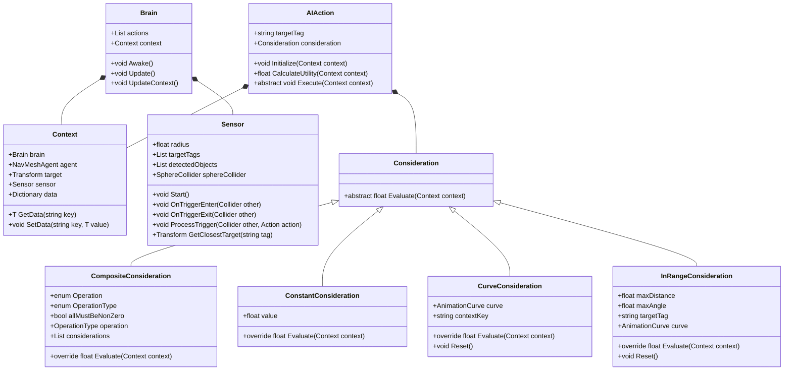
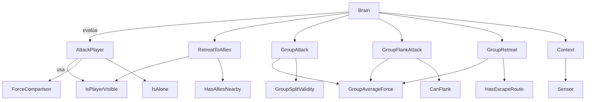

# Proyecto final de IAV - Implementación Utility AI
> **Marcos Pérez Martínez**

## Instalación y uso

> Todo el contenido del proyecto está disponible aquí en este proyecto. **Unity 2022.3.56f1** es empleado para este proyecto. También es necesario inicializar Git LFS al bajarse el repositorio. 

## Introducción
> Este es el proyectio final de la asignatura de Inteligencia Artificial para Videojuegos del Grado en Desarrollo de Videojuegos de la UCM.
>
> La idea de este proyecto es desarrollar una *Utility AI* funcional desde cero e implementar un comportamiento algo complejo a varios enemigos.

## Punto de partida
> Se parte de un proyecto base proporcionado por el profesor y disponible en este repositorio : [Minotaur - Base](https://github.com/narratech/minotaur-base).
> 
> Sin embargo, hay muchas funcionalidades de la base que se deshechan. Se mantiene la generación del laberinto y de enemigos y el movimiento del jugador. La implementación de grafo para recorrer el laberinto se quita y se sustituye por una *NavMesh* para mayor facilidad de cálculos de rutas en el proyecto. Esto se debe a que la practica en sí está enfocada en la correcta implementación de la *Utility AI* y no en la navegación. También se desecha los scripts de Agente y ComportamientoAgente.

## Planteamiento de problemas 
> ### Utility AI
> Implementar las clases básicas de una *Utility AI* para que sea utilizable para cualquier persona que se descargue el proyecto.
> ### Elementos básicos
> - Tanto el jugador como los enemigos tienen puntos de fuerza (PF). Estos puntos son asignados de forma aleatoria (hasta un máximo de 6 PF) excepto al jugador, que se le asignará 2 PF desde un inicio.
> -  A lo largo del mapa se encontrarán orbes las cuales sumarán 1 PF al jugador cuando pasa sobre ellas.
> -  Los enemigos pueden aparecer solos o acompañados. Cuando están acompañados estan quietos y si están solos hacen patruya de un punto a otro.

> [!NOTE]
> Ya se verá si meto lo de las patruyas o no.

> ### Comportamiento de los enemigos
> - Cuando un **SOLO** enemigo vea al jugador podrá tener dos comportamientos:
>   - **ATACAR**: en caso de tener más PF que le jugador. Emitirá un aviso y si hay algun enemigo cerca irá a acompañarlo. En  caso de estar acompañado.
>   - **HUIR**: en caso de tener menos puntos. En este caso, irá en busca de compañeros.
> 
> - Cuando los enemigos vayan en **GRUPO**, la acción de atarcar o huir se verá determinado por la media aritmética de los PF de todos los enemigos.
>   - **ATACAR** : si pueden, se subdivirán en dos grupos **cuya media no sea más debil que el jugador**. Un grupo atacará al jugador directamente. Otro grupo dará un rodeo para flanquear al jugador y atacarle por la espalda
>   - **HUIR** : en el caso de existir varias rutas de escape, el grupo se subdividirá en dos (de forma que los grupos sean lo más fuerte posible) y cada subgrupo tomará una de las rutas posibles.

## Estructura de Utility AI
> La estructura principal de la Utility AI se compone de los siguientes elementos:
> - **Brain** (Cerebro):
>   -  Es el componente central que gestiona las acciones y su ejecución.
>   - Utiliza un contexto para evaluar las acciones y decide cuál ejecutar basándose en la utilidad.
>   - Actualiza constantemente el contexto con la información relevante del entorno.
> - **Actions** (Acciones):
>   - Son las posibles acciones que puede realizar un agente.
>   - Cada acción tiene una consideración que evalúa su utilidad en un contexto determinado.
>   - Las acciones se ejecutan en el entorno del agente.
> - **Considerations** (Consideraciones):
>   - Son los criterios que se utilizan para evaluar la utilidad de una acción.
>   - Pueden ser simples (constantes, curvas) o compuestas (combinación de varias consideraciones).
>   - La evaluación de la utilidad se basa en el contexto actual.
> - **Context** (Contexto):
>   - Contiene toda la información relevante del entorno del agente.
>   - Incluye referencias al agente, el sensor, y datos adicionales que se pueden necesitar para evaluar las acciones.
> - **Sensor** (Sensor):
>   - Es el componente encargado de detectar objetos en el entorno.
>   - Utiliza un collider para detectar objetos y mantener una lista de objetos detectados.
>   - Proporciona métodos para obtener el objetivo más cercano con una etiqueta específica.

## Diagrama de Clases
> Aqui se muestran la estructura de las clases **BASE** implementadas para esta *Utility AI*.

## Acciones y consideraciones para el juego
### Consideraciones
| Nombre               | Tipo                                           | Descripción                                                                       |
| -------------------- | ---------------------------------------------- | --------------------------------------------------------------------------------- |
| `IsPlayerVisible`    | `InRangeConsideration`                          | Evalúa si el jugador está dentro del rango y ángulo de visión.                    |
| `ForceComparison`    | `CurveConsideration`                               | Devuelve utilidad según si el enemigo tiene más, igual o menos PF que el jugador. |
| `IsAlone`            | `ConstantConsideration` / `CurveConsideration`   | Devuelve utilidad alta si el enemigo no tiene aliados cerca.                      |
| `HasAlliesNearby`    | `ConstantConsideration`                         | Se puede usar para modificar el comportamiento en grupo.                          |
| `GroupAverageForce`  | `CurveConsideration`                             | Media de PF del grupo comparada con la del jugador.                               |
| `HasEscapeRoute`     | `ConstantConsideration`                            | Evalúa si hay rutas seguras hacia las que huir.                                   |
| `CanFlank`           | `ConstantConsideration`                           | Determina si hay una ruta alterna para flanquear.                                 |
| `GroupSplitValidity` | `ConstantConsideration`                          | Evalúa si dividir el grupo sigue siendo ventajoso.                                |
### Consideraciones compuestas
> ### 🔁 Acciones complejas mediante múltiples consideraciones
>
> **AttackPlayer**  
> • `IsPlayerVisible` → alto  
> • `ForceComparison` → enemigo > jugador  
> • `IsAlone` → alto si no hay aliados cerca  
>
> **GroupAttack**  
> • `GroupAverageForce` → mayor que jugador  
> • `GroupSplitValidity` → true  
>
> **GroupFlankAttack**  
> • `GroupAverageForce` → mayor  
> • `CanFlank` → true  
>
> **GroupRetreat**  
> • `GroupAverageForce` → menor  
> • `HasEscapeRoute` → true

### Acciones
| Nombre                | Descripción                                            |
| ------------------    | ------------------------------------------------------ |
| `AttackPlayer`        | Acerca al jugador y lo ataca si es más débil.          |
| `RetreatToAllies`     | Busca aliados cercanos y se une a ellos.               |
| `GroupAttack`         | Coordina ataque en grupo.                              |
| `GroupFlankAttack`    | Subgrupo flanquea al jugador por otra ruta.            |
| `GroupRetreat`        | Se divide el grupo y se escapan por diferentes rutas.  |
| `Patrol`              | Movimiento de un punto a otro cuando no hay estímulos. |

### Interacion entre acciones y consideraciones

> [!NOTE]
> La parte de acciones y consideraciones se irá modificando segúin el desarrollo. Más adelante se explicará la implementacion de dichas acciones y consideraciones.

